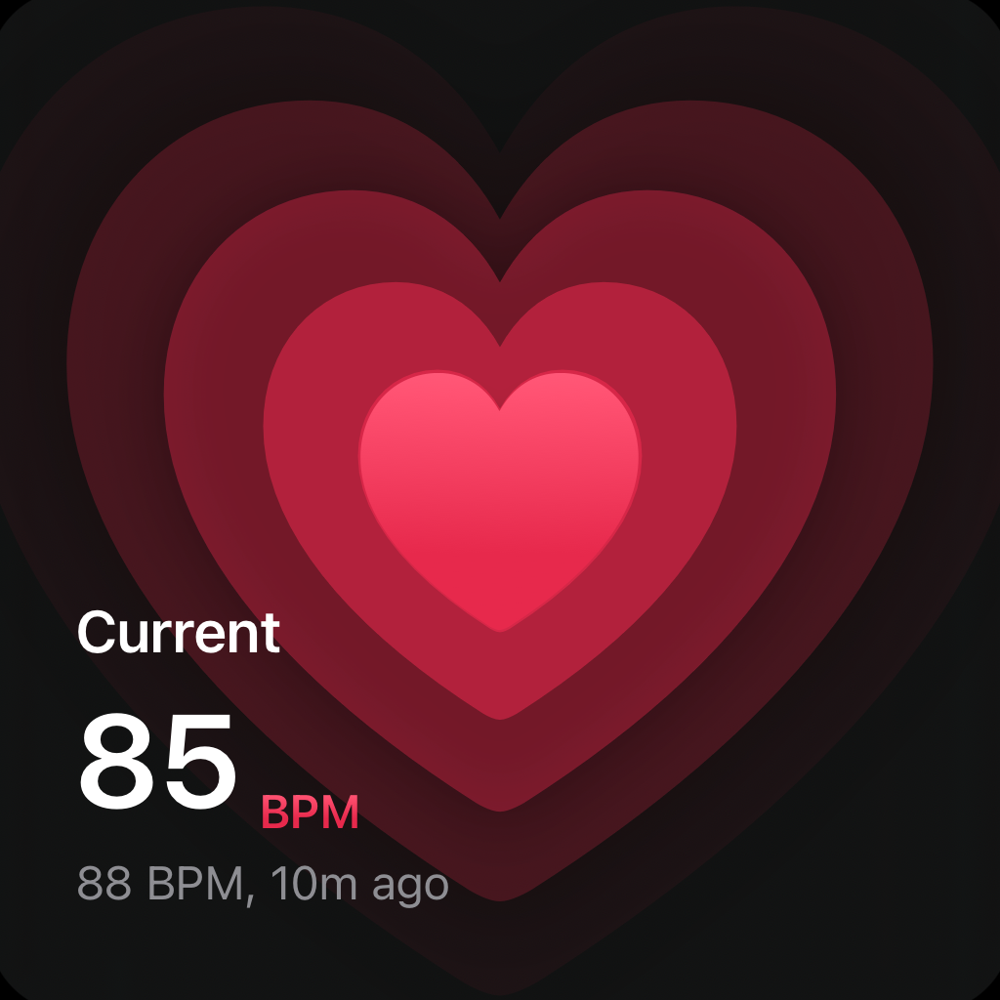

# HeartAnimation
WatchOS 10 Heart App Animation Using SwiftUI

|  |  |
|---|---|

## Introduction

All demos in this repo were written by SwiftUI. The only purpose of this repo I created is just for learning SwiftUI and comminications. All of Business incomes and Copyrights belong to Kavsoft at [Home | Kavsoft](https://kavsoft.dev).

## Reference
 [WatchOS 10 Heart App Animation Using SwiftUI | YouTube](https://www.youtube.com/watch?v=kZKI-BImtLE)

## My Development Environment
* Xcode 15.0
* Swift 5.9
* iOS 17.0
* watchOS 10.0
* macOS 13.6 Ventura
